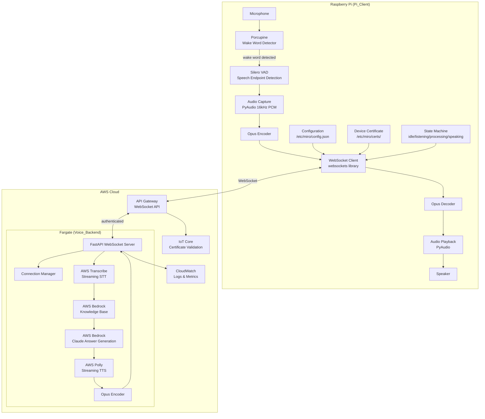
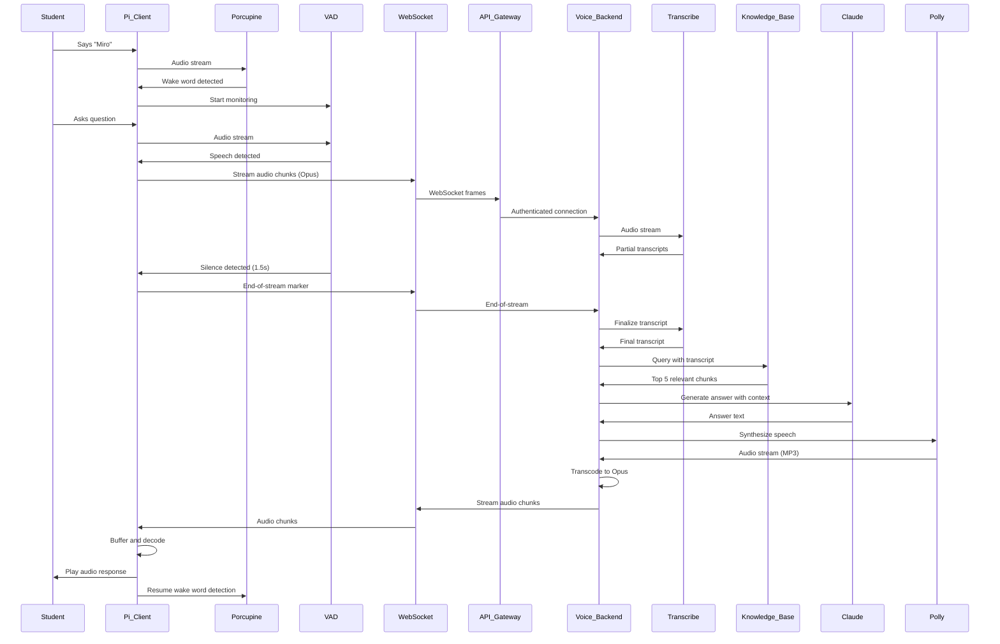
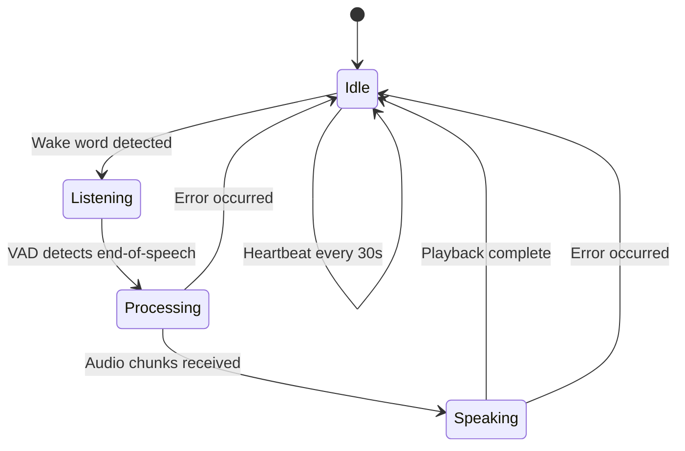

# Design Document: Always-On Voice Assistant

## Overview

The Always-On Voice Assistant transforms the Miro student component from an Electron-based GUI application into a headless, wake-word-activated voice assistant for Raspberry Pi deployment in classroom environments. The system enables students to ask questions hands-free by saying "Miro", with cloud-based processing providing accurate transcription, knowledge retrieval, and natural speech responses.

### System Architecture Summary

The system consists of two primary components:

1. **Pi_Client**: A Python application running on Raspberry Pi that handles local wake word detection (Porcupine), voice activity detection (Silero VAD), audio capture, WebSocket communication, and audio playback.

2. **Voice_Backend**: A Python FastAPI service running on AWS Fargate that orchestrates cloud processing including AWS Transcribe Streaming (STT), AWS Bedrock Knowledge Base (RAG retrieval), AWS Bedrock Claude (answer generation), and AWS Polly (TTS).

Communication occurs via WebSocket streaming through AWS API Gateway, with device authentication managed by AWS IoT Core using X.509 certificates. The architecture is designed for scalability (100+ concurrent devices), low latency (<3s end-to-end), and resource efficiency on Raspberry Pi hardware.

### Key Design Goals

- **Hands-free operation**: Wake word activation eliminates button presses
- **Low latency**: Real-time streaming for responsive interaction
- **Resource efficiency**: Runs on Raspberry Pi 4 without thermal throttling
- **Scalability**: Supports multiple classrooms simultaneously
- **Reliability**: Graceful error handling and automatic reconnection
- **Security**: Certificate-based authentication, no hardcoded credentials

## Architecture

### System Components



### Data Flow



### State Machine (Pi_Client)



## Components and Interfaces

### Pi_Client Components

#### 1. Wake Word Detector (Porcupine Integration)

**Responsibility**: Continuously monitor audio input for the wake word "Miro".

**Implementation**:
- Use Porcupine Python SDK (pvporcupine)
- Load custom wake word model for "Miro"
- Process audio in 512-sample frames (32ms at 16kHz)
- Run in dedicated thread to avoid blocking

**Interface**:
```python
class WakeWordDetector:
    def __init__(self, access_key: str, keyword_path: str):
        """Initialize Porcupine with access key and custom keyword."""
        
    def start(self) -> None:
        """Start listening for wake word in background thread."""
        
    def stop(self) -> None:
        """Stop wake word detection and cleanup resources."""
        
    def on_wake_word_detected(self, callback: Callable[[], None]) -> None:
        """Register callback to be invoked when wake word is detected."""
```

**Configuration**:
- Porcupine access key (from config.json)
- Custom keyword model path
- Sensitivity threshold (0.0-1.0, default 0.5)

**Resource Constraints**:
- CPU usage: <5%
- Memory: ~50MB
- Latency: <500ms from utterance to detection

#### 2. Voice Activity Detector (Silero VAD)

**Responsibility**: Determine when student has started and stopped speaking.

**Implementation**:
- Use Silero VAD PyTorch model
- Process audio in 30ms chunks (480 samples at 16kHz)
- Maintain speech probability threshold (default 0.5)
- Implement silence timeout (1.5 seconds)
- Maximum speech duration (30 seconds)

**Interface**:
```python
class VoiceActivityDetector:
    def __init__(self, model_path: str, threshold: float = 0.5):
        """Initialize Silero VAD model."""
        
    def start_monitoring(self) -> None:
        """Begin monitoring audio for speech activity."""
        
    def process_audio(self, audio_chunk: np.ndarray) -> bool:
        """Process audio chunk and return True if speech detected."""
        
    def is_speech_ended(self) -> bool:
        """Check if silence timeout has been reached."""
        
    def reset(self) -> None:
        """Reset VAD state for next utterance."""
        
    def on_speech_start(self, callback: Callable[[], None]) -> None:
        """Register callback for speech start event."""
        
    def on_speech_end(self, callback: Callable[[], None]) -> None:
        """Register callback for speech end event."""
```

**Configuration**:
- Speech probability threshold (0.0-1.0)
- Silence timeout duration (seconds)
- Maximum speech duration (seconds)

**Resource Constraints**:
- CPU usage: <10%
- Memory: ~100MB (model size)
- Latency: <50ms per chunk

#### 3. Audio Capture System

**Responsibility**: Capture audio from microphone at 16kHz PCM format.

**Implementation**:
- Use PyAudio library
- Configure for 16kHz sample rate, 16-bit depth, mono channel
- Buffer audio in 100ms chunks (1600 samples)
- Implement ring buffer for pre-wake-word audio (500ms)

**Interface**:
```python
class AudioCapture:
    def __init__(self, sample_rate: int = 16000, chunk_size: int = 1600):
        """Initialize PyAudio stream."""
        
    def start(self) -> None:
        """Start audio capture stream."""
        
    def stop(self) -> None:
        """Stop audio capture and cleanup."""
        
    def read_chunk(self) -> np.ndarray:
        """Read one chunk of audio data (non-blocking)."""
        
    def get_prebuffer(self) -> np.ndarray:
        """Get pre-wake-word audio buffer (500ms)."""
```

**Configuration**:
- Sample rate: 16000 Hz
- Bit depth: 16-bit signed integer
- Channels: 1 (mono)
- Chunk size: 1600 samples (100ms)
- Prebuffer size: 8000 samples (500ms)

**Audio Quality Requirements**:
- Signal-to-noise ratio: >20dB
- No clipping or distortion
- Consistent sample rate (no drift)

#### 4. WebSocket Client

**Responsibility**: Maintain bidirectional streaming connection to cloud backend.

**Implementation**:
- Use websockets Python library (async)
- Implement exponential backoff reconnection (1s, 2s, 4s, 8s, max 30s)
- Send heartbeat messages every 30 seconds
- Handle connection state (connecting, connected, disconnected)
- Queue messages during disconnection

**Interface**:
```python
class WebSocketClient:
    def __init__(self, url: str, device_id: str, cert_path: str):
        """Initialize WebSocket client with connection parameters."""
        
    async def connect(self) -> None:
        """Establish WebSocket connection with authentication."""
        
    async def disconnect(self) -> None:
        """Close WebSocket connection gracefully."""
        
    async def send_audio_chunk(self, audio_data: bytes, sequence: int) -> None:
        """Send audio chunk with metadata."""
        
    async def send_end_of_stream(self) -> None:
        """Signal end of audio stream."""
        
    async def receive_message(self) -> Dict[str, Any]:
        """Receive and parse message from server."""
        
    async def send_heartbeat(self) -> None:
        """Send heartbeat to keep connection alive."""
        
    def on_message(self, callback: Callable[[Dict], None]) -> None:
        """Register callback for incoming messages."""
        
    def on_disconnect(self, callback: Callable[[], None]) -> None:
        """Register callback for disconnection events."""
```

**Configuration**:
- WebSocket URL (wss://...)
- Device ID (unique identifier)
- Certificate path (for authentication)
- Reconnection parameters (backoff multiplier, max attempts)
- Heartbeat interval (30 seconds)

**Error Handling**:
- Automatic reconnection on connection loss
- Message queuing during disconnection
- Timeout detection (no response in 60s)

#### 5. Audio Playback System

**Responsibility**: Decode and play audio responses from cloud.

**Implementation**:
- Use PyAudio for playback
- Decode Opus audio chunks to PCM
- Implement playback buffer (500ms minimum)
- Handle chunk arrival jitter
- Smooth volume transitions

**Interface**:
```python
class AudioPlayback:
    def __init__(self, sample_rate: int = 16000):
        """Initialize PyAudio playback stream."""
        
    def start(self) -> None:
        """Start playback stream."""
        
    def stop(self) -> None:
        """Stop playback and cleanup."""
        
    def queue_audio(self, audio_data: bytes) -> None:
        """Add audio chunk to playback queue."""
        
    def is_playing(self) -> bool:
        """Check if audio is currently playing."""
        
    def on_playback_complete(self, callback: Callable[[], None]) -> None:
        """Register callback for playback completion."""
```

**Configuration**:
- Sample rate: 16000 Hz
- Buffer size: 8000 samples (500ms)
- Volume level: configurable (0.0-1.0)

**Quality Requirements**:
- No audio glitches or pops
- Smooth playback despite network jitter
- Consistent volume level

#### 6. Configuration Manager

**Responsibility**: Load and validate configuration from file.

**Implementation**:
- Read JSON configuration from /etc/miro/config.json
- Validate all required fields
- Provide defaults for optional fields
- Support environment variable overrides

**Interface**:
```python
class ConfigManager:
    def __init__(self, config_path: str = "/etc/miro/config.json"):
        """Load configuration from file."""
        
    def get(self, key: str, default: Any = None) -> Any:
        """Get configuration value by key."""
        
    def validate(self) -> List[str]:
        """Validate configuration and return list of errors."""
```

**Configuration Schema**:
```json
{
  "device_id": "classroom-01-pi",
  "api_gateway_url": "wss://api.example.com/voice",
  "certificate_path": "/etc/miro/certs/device.crt",
  "private_key_path": "/etc/miro/certs/device.key",
  "porcupine_access_key": "...",
  "porcupine_keyword_path": "/etc/miro/models/miro.ppn",
  "silero_model_path": "/etc/miro/models/silero_vad.jit",
  "audio": {
    "sample_rate": 16000,
    "chunk_size": 1600,
    "playback_volume": 0.8
  },
  "vad": {
    "threshold": 0.5,
    "silence_timeout": 1.5,
    "max_speech_duration": 30
  },
  "websocket": {
    "heartbeat_interval": 30,
    "reconnect_max_attempts": 5,
    "reconnect_backoff_base": 1
  },
  "logging": {
    "level": "INFO",
    "file": "/var/log/miro/client.log"
  }
}
```

#### 7. State Machine

**Responsibility**: Manage application state transitions and coordinate components.

**Implementation**:
- Implement finite state machine with states: idle, listening, processing, speaking
- Coordinate component lifecycle (start/stop)
- Handle state transition events
- Enforce state transition rules

**Interface**:
```python
class StateMachine:
    def __init__(self):
        """Initialize state machine in idle state."""
        
    def transition_to(self, new_state: State) -> None:
        """Transition to new state if valid."""
        
    def get_current_state(self) -> State:
        """Get current state."""
        
    def on_state_change(self, callback: Callable[[State, State], None]) -> None:
        """Register callback for state changes."""
```

**State Definitions**:
- **Idle**: Wake word detector active, waiting for "Miro"
- **Listening**: VAD active, capturing audio, streaming to cloud
- **Processing**: Audio sent, waiting for response from cloud
- **Speaking**: Playing audio response

**State Transitions**:
- Idle → Listening: Wake word detected
- Listening → Processing: VAD detects end-of-speech
- Processing → Speaking: First audio chunk received
- Speaking → Idle: Playback complete
- Any → Idle: Error occurred

### Voice_Backend Components

#### 1. FastAPI WebSocket Server

**Responsibility**: Accept and manage WebSocket connections from Pi clients.

**Implementation**:
- FastAPI with WebSocket endpoint
- Async request handling
- Connection lifecycle management
- Message routing to processing pipeline

**Interface**:
```python
@app.websocket("/voice")
async def voice_endpoint(websocket: WebSocket):
    """WebSocket endpoint for voice streaming."""
    
class WebSocketServer:
    def __init__(self):
        """Initialize FastAPI application."""
        
    async def handle_connection(self, websocket: WebSocket) -> None:
        """Handle new WebSocket connection."""
        
    async def handle_message(self, websocket: WebSocket, message: Dict) -> None:
        """Process incoming message."""
        
    async def send_message(self, websocket: WebSocket, message: Dict) -> None:
        """Send message to client."""
```

#### 2. Connection Manager

**Responsibility**: Track active connections and device state.

**Implementation**:
- In-memory connection registry (device_id → WebSocket)
- Connection metadata (connect time, message count, last activity)
- Rate limiting per device (10 queries/minute)
- Connection cleanup on disconnect

**Interface**:
```python
class ConnectionManager:
    def __init__(self):
        """Initialize connection registry."""
        
    async def register(self, device_id: str, websocket: WebSocket) -> None:
        """Register new connection."""
        
    async def unregister(self, device_id: str) -> None:
        """Remove connection from registry."""
        
    def get_connection(self, device_id: str) -> Optional[WebSocket]:
        """Get WebSocket for device."""
        
    def is_rate_limited(self, device_id: str) -> bool:
        """Check if device has exceeded rate limit."""
        
    def get_active_count(self) -> int:
        """Get number of active connections."""
```

#### 3. IoT Core Authenticator

**Responsibility**: Validate device certificates via AWS IoT Core.

**Implementation**:
- Extract certificate from WebSocket connection
- Call IoT Core DescribeCertificate API
- Verify certificate is active and not revoked
- Cache validation results (5 minute TTL)

**Interface**:
```python
class IoTAuthenticator:
    def __init__(self, iot_client):
        """Initialize with boto3 IoT client."""
        
    async def authenticate(self, certificate: str) -> Tuple[bool, str]:
        """Validate certificate and return (is_valid, device_id)."""
        
    def get_device_id(self, certificate: str) -> str:
        """Extract device ID from certificate."""
```

#### 4. Transcribe Streaming Client

**Responsibility**: Stream audio to AWS Transcribe and receive transcripts.

**Implementation**:
- Use boto3 transcribe-streaming client
- Start transcription stream with language code
- Send audio chunks as they arrive
- Receive partial and final transcripts
- Handle transcription errors

**Interface**:
```python
class TranscribeClient:
    def __init__(self, transcribe_client):
        """Initialize with boto3 transcribe client."""
        
    async def start_stream(self, language_code: str = "en-US") -> str:
        """Start transcription stream and return stream ID."""
        
    async def send_audio(self, stream_id: str, audio_chunk: bytes) -> None:
        """Send audio chunk to transcription stream."""
        
    async def end_stream(self, stream_id: str) -> None:
        """Signal end of audio stream."""
        
    async def get_transcript(self, stream_id: str) -> AsyncIterator[Dict]:
        """Yield partial and final transcripts."""
```

#### 5. Knowledge Base Query Client

**Responsibility**: Query AWS Bedrock Knowledge Base for relevant documents.

**Implementation**:
- Use boto3 bedrock-agent-runtime client
- Call retrieve API with query text
- Return top 5 results with relevance scores
- Include document metadata (title, page, source)

**Interface**:
```python
class KnowledgeBaseClient:
    def __init__(self, bedrock_client, kb_id: str):
        """Initialize with boto3 bedrock client and KB ID."""
        
    async def query(self, text: str, top_k: int = 5) -> List[Dict]:
        """Query knowledge base and return relevant chunks."""
        
    def format_context(self, results: List[Dict]) -> str:
        """Format retrieved chunks into context string."""
```

#### 6. Answer Generator (Claude)

**Responsibility**: Generate grade-appropriate answers using Claude.

**Implementation**:
- Use boto3 bedrock-runtime client
- Invoke Claude model with system prompt and context
- Stream response tokens
- Limit response to 150 words
- Include source citations

**Interface**:
```python
class AnswerGenerator:
    def __init__(self, bedrock_client, model_id: str):
        """Initialize with boto3 bedrock client and model ID."""
        
    async def generate(self, query: str, context: str, grade_level: int) -> str:
        """Generate answer with streaming."""
        
    def build_prompt(self, query: str, context: str, grade_level: int) -> str:
        """Build system prompt with context."""
```

**System Prompt Template**:
```
You are Miro, a helpful educational assistant for students in grade {grade_level}.
Answer the student's question using ONLY the provided context from their study materials.
Keep your answer under 150 words and use age-appropriate language.
Cite the source document when providing information.

Context:
{context}

Student Question: {query}

Answer:
```

#### 7. TTS Streaming Client (Polly)

**Responsibility**: Synthesize speech and stream audio back to client.

**Implementation**:
- Use boto3 polly client
- Synthesize speech with child-friendly voice
- Stream audio chunks as they're generated
- Transcode MP3 to Opus
- Include speech marks for future lip-sync

**Interface**:
```python
class TTSClient:
    def __init__(self, polly_client):
        """Initialize with boto3 polly client."""
        
    async def synthesize(self, text: str, language_code: str = "en-US") -> AsyncIterator[bytes]:
        """Synthesize speech and yield audio chunks."""
        
    def transcode_to_opus(self, mp3_data: bytes) -> bytes:
        """Convert MP3 to Opus format."""
```

**Voice Configuration**:
- Engine: Neural
- Voice: Ruth (English), Lucia (Spanish), Lea (French), Kajal (Hindi), Hala (Arabic)
- Output format: MP3 (transcoded to Opus)
- Speech rate: 150-160 WPM

#### 8. Error Handler

**Responsibility**: Handle errors gracefully and provide user feedback.

**Implementation**:
- Catch exceptions at component boundaries
- Log errors with context
- Generate user-friendly error messages
- Emit CloudWatch metrics
- Trigger alerts for critical errors

**Interface**:
```python
class ErrorHandler:
    def __init__(self, logger, metrics_client):
        """Initialize with logger and CloudWatch client."""
        
    async def handle_error(self, error: Exception, context: Dict) -> Dict:
        """Handle error and return error message for client."""
        
    def log_error(self, error: Exception, context: Dict) -> None:
        """Log error with full context."""
        
    def emit_metric(self, error_type: str) -> None:
        """Emit CloudWatch metric for error."""
```

**Error Message Templates**:
- Low transcription confidence: "I didn't understand, please repeat your question."
- Knowledge base timeout: "I'm having trouble accessing materials, please try again."
- No relevant documents: "I couldn't find information about that in your study materials."
- General error: "Something went wrong, please try again."

## Data Models

### WebSocket Message Protocol

All messages are JSON-encoded with the following envelope structure:

```json
{
  "version": "1.0",
  "message_type": "audio_chunk | end_of_stream | heartbeat | transcript | answer_text | end_of_response | error",
  "device_id": "classroom-01-pi",
  "timestamp": "2025-01-20T10:30:45.123Z",
  "payload": {}
}
```

#### Client → Server Messages

**1. Audio Chunk**
```json
{
  "version": "1.0",
  "message_type": "audio_chunk",
  "device_id": "classroom-01-pi",
  "timestamp": "2025-01-20T10:30:45.123Z",
  "payload": {
    "sequence": 42,
    "audio_data": "base64-encoded-opus-audio",
    "sample_rate": 16000,
    "encoding": "opus"
  }
}
```

**2. End of Stream**
```json
{
  "version": "1.0",
  "message_type": "end_of_stream",
  "device_id": "classroom-01-pi",
  "timestamp": "2025-01-20T10:30:47.456Z",
  "payload": {
    "total_chunks": 42,
    "duration_ms": 2500
  }
}
```

**3. Heartbeat**
```json
{
  "version": "1.0",
  "message_type": "heartbeat",
  "device_id": "classroom-01-pi",
  "timestamp": "2025-01-20T10:30:50.000Z",
  "payload": {}
}
```

#### Server → Client Messages

**1. Transcript (Partial/Final)**
```json
{
  "version": "1.0",
  "message_type": "transcript",
  "timestamp": "2025-01-20T10:30:48.000Z",
  "payload": {
    "text": "What is photosynthesis?",
    "is_final": true,
    "confidence": 0.95
  }
}
```

**2. Answer Text**
```json
{
  "version": "1.0",
  "message_type": "answer_text",
  "timestamp": "2025-01-20T10:30:49.500Z",
  "payload": {
    "text": "Photosynthesis is the process by which plants use sunlight to make food...",
    "sources": [
      {
        "title": "Biology Textbook Chapter 3",
        "page": 42
      }
    ]
  }
}
```

**3. Audio Chunk (Response)**
```json
{
  "version": "1.0",
  "message_type": "audio_chunk",
  "timestamp": "2025-01-20T10:30:50.000Z",
  "payload": {
    "sequence": 1,
    "total_chunks": 15,
    "audio_data": "base64-encoded-opus-audio",
    "sample_rate": 16000,
    "encoding": "opus"
  }
}
```

**4. End of Response**
```json
{
  "version": "1.0",
  "message_type": "end_of_response",
  "timestamp": "2025-01-20T10:30:52.000Z",
  "payload": {
    "total_chunks": 15,
    "duration_ms": 3500
  }
}
```

**5. Error**
```json
{
  "version": "1.0",
  "message_type": "error",
  "timestamp": "2025-01-20T10:30:48.000Z",
  "payload": {
    "error_code": "TRANSCRIPTION_FAILED",
    "error_message": "I didn't understand, please repeat your question.",
    "user_message": "I didn't understand, please repeat your question.",
    "retry_allowed": true
  }
}
```

### Audio Format Specifications

#### Capture Format (Pi_Client)
- **Sample Rate**: 16000 Hz
- **Bit Depth**: 16-bit signed integer (PCM_16)
- **Channels**: 1 (mono)
- **Chunk Size**: 1600 samples (100ms)
- **Format**: Raw PCM

#### Transmission Format (WebSocket)
- **Codec**: Opus
- **Bitrate**: 24 kbps (optimized for speech)
- **Frame Size**: 20ms (320 samples at 16kHz)
- **Complexity**: 5 (balance between quality and CPU)
- **Encoding**: Base64 (for JSON transport)

#### Playback Format (Pi_Client)
- **Sample Rate**: 16000 Hz
- **Bit Depth**: 16-bit signed integer (PCM_16)
- **Channels**: 1 (mono)
- **Buffer Size**: 8000 samples (500ms)

### Configuration Schema

See Configuration Manager section above for complete JSON schema.

### CloudWatch Metrics

**Voice_Backend Metrics**:
- `ConnectionCount`: Number of active WebSocket connections (Gauge)
- `QueryLatency`: Time from audio start to response start (Milliseconds)
- `TranscriptionLatency`: Time for transcription completion (Milliseconds)
- `KnowledgeBaseLatency`: Time for KB query (Milliseconds)
- `AnswerGenerationLatency`: Time for Claude response (Milliseconds)
- `TTSLatency`: Time for TTS synthesis (Milliseconds)
- `ErrorRate`: Errors per minute (Count)
- `ErrorType`: Error breakdown by type (Count with dimension)

**Alarms**:
- ErrorRate > 5% over 5 minutes → SNS notification
- QueryLatency > 5000ms (p99) → SNS notification
- ConnectionCount > 90 → Auto-scaling trigger


## Correctness Properties

*A property is a characteristic or behavior that should hold true across all valid executions of a system—essentially, a formal statement about what the system should do. Properties serve as the bridge between human-readable specifications and machine-verifiable correctness guarantees.*

### Property 1: Wake Word Detection Latency

*For any* wake word detection event, the time from wake word utterance to audio capture trigger should be less than 500ms.

**Validates: Requirements 1.2**

### Property 2: Wake Word Detector CPU Usage

*For any* continuous operation period, the Wake_Word_Detector CPU usage should remain below 5% on Raspberry Pi 4.

**Validates: Requirements 1.3**

### Property 3: Wake Word Detection Accuracy

*For any* audio sample containing the wake word "Miro" in a quiet environment, the Wake_Word_Detector should detect it with at least 95% probability.

**Validates: Requirements 1.4**

### Property 4: Wake Word False Positive Rejection

*For any* audio sample not containing the wake word, the Wake_Word_Detector should correctly reject it with at least 98% probability.

**Validates: Requirements 1.5**

### Property 5: Wake Word Suppression During Processing

*For any* query being processed, additional wake word detections should be ignored until the query completes.

**Validates: Requirements 1.6**

### Property 6: VAD Speech Buffering

*For any* speech segment detected by VAD, audio data should be continuously buffered throughout the entire speech duration.

**Validates: Requirements 2.2**

### Property 7: VAD Silence Detection

*For any* speech segment followed by 1.5 seconds of silence, the VAD should signal end-of-speech.

**Validates: Requirements 2.3**

### Property 8: VAD Speech Classification Accuracy

*For any* audio sample containing speech or classroom noise, the VAD should correctly classify it with at least 90% accuracy.

**Validates: Requirements 2.4**

### Property 9: VAD CPU Usage

*For any* monitoring period, the VAD CPU usage should remain below 10% on Raspberry Pi 4.

**Validates: Requirements 2.5**

### Property 10: Audio Capture Format

*For any* audio capture session, audio should be captured at 16kHz sample rate, buffered in 100ms chunks (1600 samples), and encoded in PCM 16-bit signed integer mono format.

**Validates: Requirements 3.1, 3.2, 3.3, 16.1**

### Property 11: Audio Quality Preservation

*For any* captured audio, the signal-to-noise ratio should be above 20dB.

**Validates: Requirements 3.5**

### Property 12: WebSocket Authentication Before Data

*For any* WebSocket connection, device certificate authentication must complete successfully before any audio data is transmitted.

**Validates: Requirements 4.2**

### Property 13: WebSocket Reconnection Backoff

*For any* connection loss event, reconnection attempts should follow exponential backoff with delays of 1s, 2s, 4s, 8s, and maximum 30s.

**Validates: Requirements 4.3**

### Property 14: WebSocket Heartbeat Interval

*For any* active WebSocket connection, heartbeat messages should be sent every 30 seconds (±2 seconds tolerance).

**Validates: Requirements 4.4**

### Property 15: WebSocket Connection Ready Time

*For any* successful connection establishment, the WebSocket should be ready to stream audio within 100ms.

**Validates: Requirements 4.6**

### Property 16: Audio Streaming Real-Time

*For any* audio capture session, audio chunks should be streamed to Voice_Backend in real-time without batching delays.

**Validates: Requirements 5.1**

### Property 17: Audio Chunk Transmission Latency

*For any* audio chunk, the time from capture to WebSocket transmission should be less than 200ms.

**Validates: Requirements 5.2**

### Property 18: Opus Audio Compression

*For any* audio chunk transmitted over WebSocket, it should be compressed using Opus codec before transmission.

**Validates: Requirements 5.6, 16.2**

### Property 19: Device Certificate Uniqueness

*For any* two Raspberry Pi devices, their device certificates should be unique (different certificate IDs).

**Validates: Requirements 6.2**

### Property 20: Invalid Certificate Rejection

*For any* invalid or expired device certificate, the IoT_Authenticator should reject the connection.

**Validates: Requirements 6.3**

### Property 21: Certificate Read-Only Storage

*For any* device, the device certificate should be stored in a read-only filesystem location.

**Validates: Requirements 6.4**

### Property 22: Certificate Rotation Without Reboot

*For any* certificate rotation operation, the system should continue functioning without requiring a device reboot.

**Validates: Requirements 6.5**

### Property 23: Backend Authentication Validation

*For any* incoming WebSocket connection, the Voice_Backend should validate device authentication via IoT_Authenticator before accepting data.

**Validates: Requirements 7.2**

### Property 24: Audio Chunk Sequence Ordering

*For any* sequence of audio chunks received by Voice_Backend, they should be buffered in sequence number order.

**Validates: Requirements 7.3**

### Property 25: Missing Chunk Detection

*For any* audio chunk sequence with gaps, the Voice_Backend should detect missing chunks using sequence numbers.

**Validates: Requirements 7.4**

### Property 26: Out-of-Order Chunk Reordering

*For any* audio chunks arriving out of order, the Voice_Backend should reorder them correctly before processing.

**Validates: Requirements 7.5**

### Property 27: Transcription Partial Results

*For any* audio stream being transcribed, the Transcribe_Stream should return partial transcripts as audio is processed.

**Validates: Requirements 8.2**

### Property 28: Transcription Confidence Scores

*For any* completed transcription, the final transcript should include confidence scores.

**Validates: Requirements 8.3**

### Property 29: Transcription Word Accuracy

*For any* clear speech audio sample, the Transcribe_Stream should achieve at least 90% word accuracy.

**Validates: Requirements 8.4**

### Property 30: Multi-Language Transcription Support

*For any* audio in English, Spanish, French, Hindi, or Arabic, the Transcribe_Stream should successfully transcribe it.

**Validates: Requirements 8.6**

### Property 31: Knowledge Base Result Count

*For any* knowledge base query, the system should return at most 5 document chunks (or fewer if insufficient documents exist).

**Validates: Requirements 9.2**

### Property 32: Knowledge Base Relevance Scores

*For any* document chunk returned by Knowledge_Base, it should include a relevance score.

**Validates: Requirements 9.3**

### Property 33: Knowledge Base Query Latency

*For any* knowledge base query, results should be returned within 1 second.

**Validates: Requirements 9.4**

### Property 34: Knowledge Base Document Metadata

*For any* retrieved document chunk, it should include metadata (title, page number).

**Validates: Requirements 9.6**

### Property 35: Answer Source Citations

*For any* generated answer, it should cite the source documents used.

**Validates: Requirements 10.3**

### Property 36: Answer Generation Latency

*For any* answer generation request, the response should be generated within 2 seconds.

**Validates: Requirements 10.4**

### Property 37: Answer Length Limit

*For any* generated answer, the word count should be 150 words or fewer.

**Validates: Requirements 10.5**

### Property 38: TTS Audio Streaming

*For any* TTS synthesis request, audio chunks should be streamed back to Voice_Backend as they are generated (not batched).

**Validates: Requirements 11.3**

### Property 39: TTS Speaking Rate

*For any* generated speech, the speaking rate should be between 150-160 words per minute.

**Validates: Requirements 11.4**

### Property 40: TTS Multi-Language Support

*For any* text in English, Spanish, French, Hindi, or Arabic, the TTS_Engine should synthesize speech in the matching language.

**Validates: Requirements 11.5**

### Property 41: TTS Speech Marks

*For any* TTS output, speech marks (phoneme timing data) should be included for lip-sync animation.

**Validates: Requirements 11.6**

### Property 42: TTS Chunk Streaming Latency

*For any* TTS audio chunk, the time from generation to WebSocket transmission should be less than 100ms.

**Validates: Requirements 12.2**

### Property 43: Backend Opus Compression

*For any* audio chunk sent from Voice_Backend to client, it should be compressed using Opus codec.

**Validates: Requirements 12.5**

### Property 44: Audio Playback Buffering

*For any* audio chunks arriving at Pi_Client, they should be buffered in a playback queue.

**Validates: Requirements 13.1**

### Property 45: Playback Start Delay

*For any* playback session, playback should begin after buffering 500ms of audio.

**Validates: Requirements 13.2**

### Property 46: Playback Volume Consistency

*For any* playback session, audio should be played at a consistent volume level throughout.

**Validates: Requirements 13.3**

### Property 47: Playback Jitter Handling

*For any* audio stream with chunk arrival jitter, playback should remain smooth without glitches.

**Validates: Requirements 13.4**

### Property 48: Error Logging Format

*For any* error that occurs, the system should log it with timestamp and device_id.

**Validates: Requirements 14.5**

### Property 49: State Transition Audio Feedback

*For any* state transition (wake word detected, processing, speaking), the Pi_Client should provide audio feedback.

**Validates: Requirements 14.6**

### Property 50: API Gateway Connection Capacity

*For any* load condition, the API_Gateway should support at least 100 concurrent WebSocket connections.

**Validates: Requirements 15.1**

### Property 51: Concurrent Query Independence

*For any* two concurrent student queries, they should be processed independently without blocking each other.

**Validates: Requirements 15.4**

### Property 52: Response Time Under Load

*For any* query at 80% system capacity, the response time should remain under 3 seconds.

**Validates: Requirements 15.5**

### Property 53: Device Rate Limiting

*For any* device, the Voice_Backend should limit queries to maximum 10 per minute.

**Validates: Requirements 15.6**

### Property 54: Backend Opus Decoding

*For any* Opus-encoded audio received by Voice_Backend, it should be decoded back to PCM format.

**Validates: Requirements 16.3**

### Property 55: TTS MP3 Output Format

*For any* TTS synthesis, the TTS_Engine should generate audio in MP3 format.

**Validates: Requirements 16.4**

### Property 56: MP3 to Opus Transcoding

*For any* MP3 audio from TTS_Engine, the Voice_Backend should transcode it to Opus before streaming to device.

**Validates: Requirements 16.5**

### Property 57: Audio Codec Round-Trip Quality

*For any* audio data, encoding to Opus then decoding back to PCM should preserve intelligibility with PESQ score greater than 3.5.

**Validates: Requirements 16.6**

### Property 58: WebSocket Message Format

*For any* message sent by WebSocket_Client, it should be formatted as JSON with fields: version, message_type, device_id, timestamp, and payload.

**Validates: Requirements 17.1**

### Property 59: Client Message Type Support

*For any* message of type audio_chunk, end_of_stream, heartbeat, or error, the WebSocket_Client should correctly format and send it.

**Validates: Requirements 17.2**

### Property 60: Backend Response Format

*For any* response sent by Voice_Backend, it should be formatted as JSON with fields: version, message_type, and payload.

**Validates: Requirements 17.3**

### Property 61: Backend Message Type Support

*For any* message of type audio_chunk, transcript, answer_text, end_of_response, or error, the Voice_Backend should correctly format and send it.

**Validates: Requirements 17.4**

### Property 62: Protocol Version Field

*For any* WebSocket message, it should include a version field for backward compatibility.

**Validates: Requirements 17.5**

### Property 63: Message Serialization Round-Trip

*For any* valid WebSocket message, parsing then serializing should produce an equivalent message structure (same fields and values).

**Validates: Requirements 17.6**

### Property 64: Configuration Schema Validation

*For any* valid configuration file, it should include required fields: api_gateway_url, device_id, certificate_path, and audio_settings.

**Validates: Requirements 18.2**

### Property 65: Configuration Startup Validation

*For any* Pi_Client startup, the configuration should be validated before proceeding.

**Validates: Requirements 18.3**

### Property 66: Configuration Update Without Code Changes

*For any* configuration parameter change, the system should support it without requiring code modifications.

**Validates: Requirements 18.5**

### Property 67: CloudWatch Metrics Emission

*For any* Voice_Backend operation, relevant CloudWatch metrics (connection_count, query_latency, error_rate) should be emitted.

**Validates: Requirements 19.2**

### Property 68: Error Stack Trace Logging

*For any* error in Voice_Backend, it should be logged with a complete stack trace.

**Validates: Requirements 19.3**

### Property 69: End-to-End Latency Tracking

*For any* student query, the system should track end-to-end latency from wake word detection to audio playback start.

**Validates: Requirements 19.4**

### Property 70: Log Message Device ID

*For any* log message from Pi_Client, it should include the device_id field.

**Validates: Requirements 19.6**

### Property 71: Pi Client CPU Usage

*For any* operation period, the Pi_Client should use less than 30% CPU on average on Raspberry Pi 4.

**Validates: Requirements 20.1**

### Property 72: Pi Client Memory Usage

*For any* operation period, the Pi_Client should use less than 200MB RAM.

**Validates: Requirements 20.2**

### Property 73: Idle Resource Release

*For any* idle period, the Pi_Client should release resources properly (no memory leaks, file handles closed).

**Validates: Requirements 20.4**

## Error Handling

### Error Categories

The system handles errors across multiple layers:

1. **Hardware Errors**: Microphone/speaker failures, network disconnections
2. **Authentication Errors**: Invalid certificates, expired credentials
3. **Processing Errors**: Transcription failures, knowledge base timeouts, TTS failures
4. **Resource Errors**: Memory exhaustion, CPU throttling, buffer overflows
5. **Protocol Errors**: Malformed messages, sequence gaps, timeout violations

### Error Handling Strategies

#### 1. Wake Word Detection Errors

**Failure Mode**: Porcupine fails to initialize (missing model file, invalid access key)

**Detection**: Exception during WakeWordDetector initialization

**Recovery**:
- Log error with diagnostic information (model path, access key validity)
- Play error tone (3 beeps)
- Exit with error code 1
- Systemd restarts service

**User Feedback**: Error tone indicates system is not operational

#### 2. VAD Errors

**Failure Mode**: Silero VAD model fails to load or process audio

**Detection**: Exception during VAD initialization or process_audio()

**Recovery**:
- Fall back to amplitude-based endpoint detection (simple threshold)
- Log warning about degraded mode
- Continue operation with reduced accuracy

**User Feedback**: None (transparent fallback)

#### 3. WebSocket Connection Errors

**Failure Mode**: Cannot establish connection to API Gateway

**Detection**: Connection timeout, authentication failure, network unreachable

**Recovery**:
- Exponential backoff reconnection (1s, 2s, 4s, 8s, max 30s)
- Queue audio locally during disconnection (max 30 seconds)
- After 5 failed attempts, play "connection error" message
- Continue attempting reconnection indefinitely

**User Feedback**: Audio message after 5 failures: "I'm having trouble connecting. Please check the network."

#### 4. Audio Streaming Errors

**Failure Mode**: Network latency exceeds 500ms, chunks dropped

**Detection**: WebSocket send timeout, acknowledgment timeout

**Recovery**:
- Buffer audio locally (max 5MB)
- If buffer full, discard oldest chunks
- When connection recovers, resume streaming
- Log warning about packet loss

**User Feedback**: If latency >500ms: "I'm experiencing network delays."

#### 5. Authentication Errors

**Failure Mode**: Device certificate invalid, expired, or revoked

**Detection**: IoT_Authenticator returns authentication failure

**Recovery**:
- Log error with certificate details
- Wait 60 seconds before retry
- After 10 failures, play error message and stop retrying
- Require manual intervention (certificate renewal)

**User Feedback**: After 10 failures: "Authentication failed. Please contact support."

#### 6. Transcription Errors

**Failure Mode**: Transcribe service timeout, low confidence (<70%)

**Detection**: Transcribe API timeout, confidence score below threshold

**Recovery**:
- If timeout: Retry once with same audio
- If low confidence: Send clarification request to student
- If repeated failures: Log error and skip query

**User Feedback**: "I didn't understand. Could you please repeat your question?"

#### 7. Knowledge Base Errors

**Failure Mode**: Knowledge Base query timeout, no relevant results

**Detection**: Bedrock API timeout, all relevance scores <0.3

**Recovery**:
- If timeout: Retry once with exponential backoff
- If no results: Generate "out of scope" response
- Log query for analysis

**User Feedback**: 
- Timeout: "I'm having trouble accessing materials. Please try again."
- No results: "I couldn't find information about that in your study materials."

#### 8. Answer Generation Errors

**Failure Mode**: Claude API timeout, content policy violation

**Detection**: Bedrock API timeout, content filter triggered

**Recovery**:
- If timeout: Retry once
- If content violation: Generate safe fallback response
- Log error for review

**User Feedback**: "I'm having trouble generating an answer. Please try again."

#### 9. TTS Errors

**Failure Mode**: Polly service timeout, unsupported language

**Detection**: Polly API timeout, language code error

**Recovery**:
- If timeout: Retry once
- If unsupported language: Fall back to English
- If repeated failures: Send text response without audio

**User Feedback**: Text displayed on screen (if available), or silence with error log

#### 10. Audio Playback Errors

**Failure Mode**: Speaker failure, buffer underrun, codec error

**Detection**: PyAudio exception, buffer empty during playback

**Recovery**:
- If buffer underrun: Pause playback, wait for more chunks
- If speaker failure: Log error, display text response
- If codec error: Skip corrupted chunk, continue with next

**User Feedback**: None (transparent recovery) or text fallback

#### 11. Resource Exhaustion Errors

**Failure Mode**: Memory exceeds 250MB, CPU throttling detected

**Detection**: Memory monitoring, CPU temperature monitoring

**Recovery**:
- If memory high: Trigger garbage collection, log warning
- If still high: Clear audio buffers, restart components
- If CPU throttling: Reduce processing (lower VAD frequency)
- If critical: Restart service

**User Feedback**: None (transparent recovery)

#### 12. Configuration Errors

**Failure Mode**: Invalid config file, missing required fields

**Detection**: JSON parse error, schema validation failure

**Recovery**:
- Log specific validation errors
- Exit with error code 2
- Require manual configuration fix

**User Feedback**: Error logged to /var/log/miro/client.log

### Error Logging Format

All errors are logged with the following structure:

```json
{
  "timestamp": "2025-01-20T10:30:45.123Z",
  "level": "ERROR",
  "device_id": "classroom-01-pi",
  "component": "WebSocketClient",
  "error_type": "ConnectionTimeout",
  "error_message": "Failed to connect to wss://api.example.com/voice",
  "stack_trace": "...",
  "context": {
    "retry_count": 3,
    "last_successful_connection": "2025-01-20T10:25:00.000Z"
  }
}
```

### CloudWatch Alarms

The Voice_Backend emits CloudWatch alarms for:

1. **High Error Rate**: ErrorRate > 5% over 5 minutes
2. **High Latency**: QueryLatency p99 > 5000ms
3. **Connection Failures**: ConnectionFailureRate > 10% over 5 minutes
4. **Service Unavailability**: HealthCheckFailures > 3 consecutive

All alarms trigger SNS notifications to operations team.

## Testing Strategy

### Dual Testing Approach

The system requires both unit testing and property-based testing for comprehensive coverage:

- **Unit tests**: Verify specific examples, edge cases, and error conditions
- **Property tests**: Verify universal properties across all inputs

Both approaches are complementary and necessary. Unit tests catch concrete bugs in specific scenarios, while property tests verify general correctness across a wide input space.

### Unit Testing

Unit tests focus on:

1. **Specific Examples**:
   - Wake word detection with sample audio file
   - VAD endpoint detection with known speech segment
   - WebSocket message parsing with example JSON
   - Configuration loading with sample config file

2. **Edge Cases**:
   - Maximum speech duration (30 seconds)
   - Audio buffer overflow (>5MB)
   - WebSocket reconnection after 5 failures
   - Low transcription confidence (<70%)
   - No relevant knowledge base results
   - Memory usage exceeding 250MB

3. **Error Conditions**:
   - Invalid device certificate
   - Malformed WebSocket messages
   - Network timeout during streaming
   - TTS service unavailable
   - Configuration file missing required fields

4. **Integration Points**:
   - Wake word detector → VAD handoff
   - VAD → WebSocket streaming
   - WebSocket → Backend processing pipeline
   - Backend → TTS → Playback

### Property-Based Testing

Property tests verify universal properties using randomized inputs. Each test runs a minimum of 100 iterations.

#### Test Library Selection

- **Python**: Use `hypothesis` library for property-based testing
- **Audio Generation**: Use `numpy` and `scipy` for synthetic audio
- **Message Generation**: Use `hypothesis.strategies` for JSON generation

#### Property Test Configuration

Each property test must:
- Run minimum 100 iterations (configured via `@given` decorator)
- Reference the design document property in a comment
- Use appropriate generators for input data
- Include shrinking for minimal failing examples

#### Tag Format

```python
@given(audio=audio_strategy(), wake_word_position=st.integers(0, 1000))
@settings(max_examples=100)
def test_wake_word_detection_latency(audio, wake_word_position):
    """
    Feature: always-on-voice-assistant, Property 1: Wake Word Detection Latency
    
    For any wake word detection event, the time from wake word utterance 
    to audio capture trigger should be less than 500ms.
    """
    # Test implementation
```

#### Property Test Examples

**Property 1: Wake Word Detection Latency**
```python
@given(
    audio=audio_with_wake_word_strategy(),
    noise_level=st.floats(0.0, 0.3)
)
@settings(max_examples=100)
def test_wake_word_detection_latency(audio, noise_level):
    """Feature: always-on-voice-assistant, Property 1"""
    detector = WakeWordDetector(access_key, keyword_path)
    start_time = time.time()
    detector.process_audio(audio)
    detection_time = time.time() - start_time
    assert detection_time < 0.5  # 500ms
```

**Property 10: Audio Capture Format**
```python
@given(duration=st.floats(0.1, 10.0))
@settings(max_examples=100)
def test_audio_capture_format(duration):
    """Feature: always-on-voice-assistant, Property 10"""
    capture = AudioCapture(sample_rate=16000, chunk_size=1600)
    capture.start()
    chunks = []
    for _ in range(int(duration * 10)):  # 100ms chunks
        chunk = capture.read_chunk()
        chunks.append(chunk)
    capture.stop()
    
    # Verify format
    for chunk in chunks:
        assert chunk.dtype == np.int16  # 16-bit signed integer
        assert len(chunk) == 1600  # 100ms at 16kHz
        assert chunk.ndim == 1  # Mono
```

**Property 63: Message Serialization Round-Trip**
```python
@given(message=websocket_message_strategy())
@settings(max_examples=100)
def test_message_round_trip(message):
    """Feature: always-on-voice-assistant, Property 63"""
    # Serialize
    serialized = json.dumps(message)
    
    # Parse
    parsed = json.loads(serialized)
    
    # Verify equivalence
    assert parsed == message
    assert parsed["version"] == message["version"]
    assert parsed["message_type"] == message["message_type"]
    assert parsed["device_id"] == message["device_id"]
```

**Property 57: Audio Codec Round-Trip Quality**
```python
@given(audio=pcm_audio_strategy())
@settings(max_examples=100)
def test_audio_codec_round_trip(audio):
    """Feature: always-on-voice-assistant, Property 57"""
    # Encode to Opus
    opus_encoder = OpusEncoder(sample_rate=16000, channels=1)
    encoded = opus_encoder.encode(audio)
    
    # Decode back to PCM
    opus_decoder = OpusDecoder(sample_rate=16000, channels=1)
    decoded = opus_decoder.decode(encoded)
    
    # Measure PESQ score
    pesq_score = calculate_pesq(audio, decoded, sample_rate=16000)
    assert pesq_score > 3.5
```

#### Custom Generators

```python
# Audio with wake word
@st.composite
def audio_with_wake_word_strategy(draw):
    duration = draw(st.floats(1.0, 5.0))
    wake_word_position = draw(st.floats(0.1, duration - 0.5))
    noise_level = draw(st.floats(0.0, 0.3))
    
    # Generate audio with wake word embedded
    audio = generate_audio_with_wake_word(
        duration=duration,
        wake_word_position=wake_word_position,
        noise_level=noise_level
    )
    return audio

# WebSocket message
@st.composite
def websocket_message_strategy(draw):
    message_type = draw(st.sampled_from([
        "audio_chunk", "end_of_stream", "heartbeat", "error"
    ]))
    device_id = draw(st.text(min_size=1, max_size=50))
    timestamp = draw(st.datetimes())
    
    return {
        "version": "1.0",
        "message_type": message_type,
        "device_id": device_id,
        "timestamp": timestamp.isoformat(),
        "payload": {}
    }

# PCM audio
@st.composite
def pcm_audio_strategy(draw):
    duration = draw(st.floats(0.1, 5.0))
    sample_rate = 16000
    num_samples = int(duration * sample_rate)
    
    # Generate random PCM audio
    audio = draw(st.lists(
        st.integers(-32768, 32767),
        min_size=num_samples,
        max_size=num_samples
    ))
    return np.array(audio, dtype=np.int16)
```

### Integration Testing

Integration tests verify component interactions:

1. **Wake Word → VAD → Streaming Pipeline**:
   - Speak wake word → VAD activates → Audio streams to backend
   - Verify end-to-end latency <3 seconds

2. **Backend Processing Pipeline**:
   - Audio received → Transcribed → KB queried → Answer generated → TTS → Streamed back
   - Verify each stage completes within latency budget

3. **Error Recovery**:
   - Disconnect WebSocket mid-stream → Verify reconnection and resume
   - Simulate low confidence transcription → Verify clarification request

### Load Testing

Load tests verify scalability requirements:

1. **Concurrent Connections**: Establish 100 WebSocket connections simultaneously
2. **Query Throughput**: Process 50 concurrent queries and measure latency
3. **Rate Limiting**: Verify 10 queries/minute limit per device
4. **Auto-Scaling**: Trigger load increase and verify Fargate scales within 30 seconds

### Performance Testing

Performance tests verify resource constraints:

1. **CPU Usage**: Monitor Pi_Client CPU usage over 1 hour, verify <30% average
2. **Memory Usage**: Monitor Pi_Client memory over 1 hour, verify <200MB
3. **Thermal**: Run continuous queries for 1 hour, verify no thermal throttling
4. **Stability**: Run Pi_Client for 7 days, verify no crashes or memory leaks

### Test Coverage Goals

- **Unit Test Coverage**: >80% line coverage
- **Property Test Coverage**: All 73 properties implemented
- **Integration Test Coverage**: All component boundaries tested
- **Edge Case Coverage**: All edge cases from requirements tested

### Continuous Integration

All tests run on every commit:
1. Unit tests (fast feedback)
2. Property tests (100 iterations each)
3. Integration tests (critical paths)
4. Load tests (nightly)
5. Performance tests (weekly)

Test failures block deployment to production.
