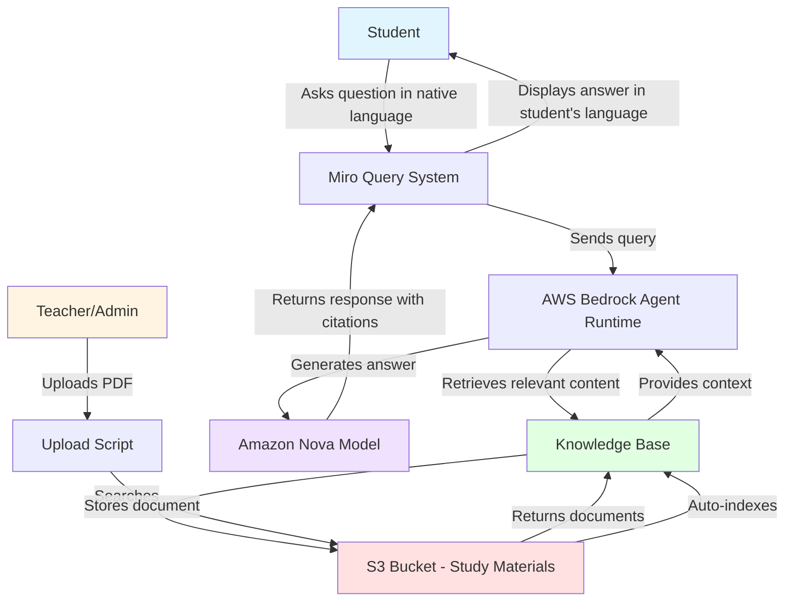

# Miro 🌍

**A multilingual AI companion for students in underprivileged schools across the world.**

## Vision

Miro is built on the belief that every student deserves access to quality education, regardless of their language or location. By leveraging AI and multilingual capabilities, Miro breaks down language barriers and makes educational content accessible to students worldwide.

Students can ask questions in their native language and receive clear, accurate answers - even when the original study materials are in a different language. This opens up a world of knowledge to learners who might otherwise be left behind.

## Features

- **Multilingual Support**: Ask questions in any language, get answers in your preferred language
- **RAG-Powered Accuracy**: Retrieves information from verified study materials to ensure accurate, grounded responses
- **Student-Friendly**: Designed specifically for students in Class 1-10, with age-appropriate explanations
- **Interactive Learning**: Chat-based interface for natural, conversational learning
- **Source Citations**: Shows which documents were used to generate each answer
- **Easy Content Management**: Simple tools to upload and manage study materials

## Project Structure

```
Miro/
├── test.py              # Interactive RAG query system
├── upload_to_s3.py      # Upload PDFs to S3 bucket
├── prompt.txt           # System prompt configuration
├── requirements.txt     # Python dependencies
├── .env.example         # Environment variables template
└── README.md           # This file
```

## Setup

### Prerequisites

- Python 3.8 or higher
- AWS Account with Bedrock access
- S3 bucket for storing study materials
- Bedrock Knowledge Base configured

### Installation

1. Clone the repository:
```bash
git clone <repository-url>
cd Miro
```

2. Create and activate a virtual environment:
```bash
python -m venv venv
source venv/bin/activate  # On Windows: venv\Scripts\activate
```

3. Install dependencies:
```bash
pip install -r requirements.txt
```

4. Configure environment variables:
```bash
cp .env.example .env
```

Edit `.env` and add your AWS credentials and configuration:
```
AWS_REGION=us-east-1
AWS_ACCESS_KEY_ID=your_access_key
AWS_SECRET_ACCESS_KEY=your_secret_key

BEDROCK_UPLOAD_ACCESS_KEY_ID=your_upload_key
BEDROCK_UPLOAD_SECRET_ACCESS_KEY=your_upload_secret

KNOWLEDGE_BASE_ID=your_knowledge_base_id
MODEL_ID=amazon.nova-micro-v1:0
MAX_RESULTS=5
```

## Usage

### Querying the Knowledge Base

Run the interactive query system:

```bash
python test.py
```

Or ask a single question:

```bash
python test.py "what is photosynthesis?"
```

### Uploading Study Materials

Upload a PDF to the knowledge base:

```bash
python upload_to_s3.py path/to/document.pdf
```

The PDF will be uploaded to your S3 bucket and automatically indexed by the Bedrock Knowledge Base.

## How It Works



### Workflow

1. **Content Upload**: Teachers or administrators upload study materials (PDFs) to an S3 bucket
2. **Indexing**: AWS Bedrock Knowledge Base automatically indexes the content
3. **Student Query**: Students ask questions in their native language
4. **Retrieval**: The system finds relevant information from the study materials
5. **Generation**: AI generates a clear, concise answer in the student's language
6. **Response**: The answer is displayed with source citations

## Customization

### Modifying the System Prompt

Edit `prompt.txt` to customize how Miro responds to students. The current configuration focuses on:
- Age-appropriate language
- Concise responses (3-7 lines)
- Friendly, encouraging tone
- Strict adherence to source materials

### Adjusting Response Parameters

Edit the `.env` file to modify:
- `MAX_RESULTS`: Number of source documents to retrieve (default: 5)
- `MODEL_ID`: The AI model to use for generation

## Contributing

We welcome contributions to make Miro better for students worldwide! Whether it's:
- Adding support for more languages
- Improving response quality
- Enhancing the user interface
- Adding new features

Please feel free to open issues or submit pull requests.

## License

This project is dedicated to improving educational accessibility for underprivileged students worldwide.

## Acknowledgments

Built with:
- AWS Bedrock for AI capabilities
- Amazon Nova models for multilingual understanding
- Python and boto3 for AWS integration

---

**Making education accessible, one question at a time.** 🌟
